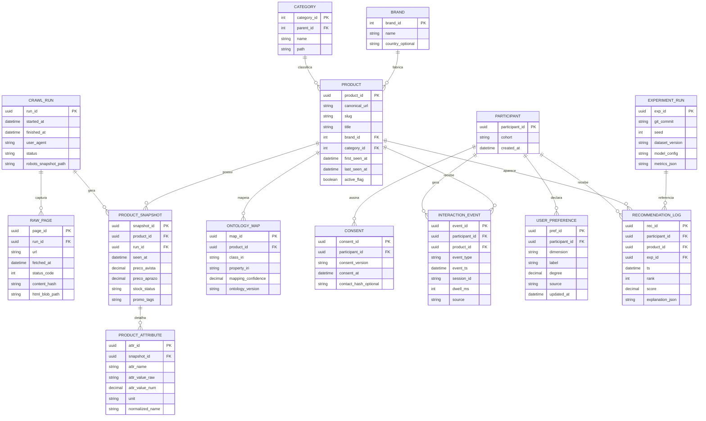
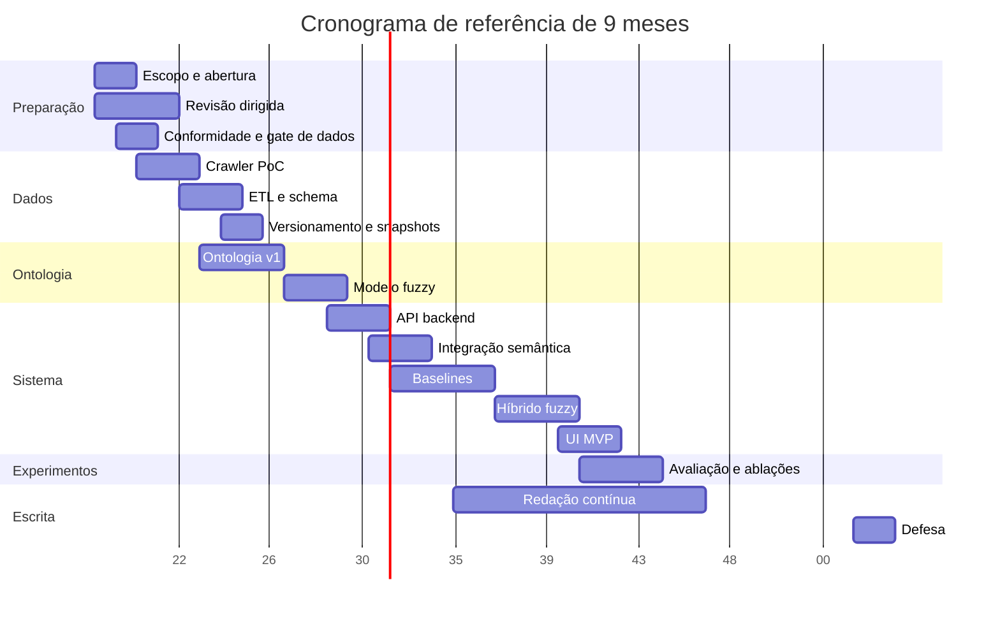

# Plano completo de projeto para um TCC sobre sistema de recomendação híbrido com ontologias fuzzy aplicado ao domínio da Kouzina Club

## Resumo executivo e premissas

Este plano parte de um recorte tecnicamente viável e academicamente defensável: usar o **catálogo público** da Kouzina Club como **dataset de domínio** e separar claramente esse dataset catalogal de qualquer dado pessoal ou transacional de clientes. A Kouzina Club se apresenta publicamente como loja especializada em **equipamentos para cozinhas de luxo**, com categorias expostas como **Cozinha, Espaço Gourmet, Lavanderia e Refrigeração**, além de marcas como **Bertazzoni, Coyote, Crissair, Elettromec, Elica, Franke, Gorenje, LG, Lofra, Speed Queen e Tecno**. As páginas públicas também exibem atributos muito úteis para uma ontologia de produtos de alto padrão, como **preço à vista e a prazo, disponibilidade, tags promocionais, filtros por preço, disponibilidade, marca, queimadores e voltagem**, e descrições técnicas com largura em cm, litros, garrafas, número de serviços, “dual zone”, “Air Fry”, “Steam Assist”, “Connect” e “AdaptTech”. Isso torna o site um domínio excelente para um recomendador semântico-fuzzy. citeturn11search3turn11search4turn11search6turn12search5turn12search10turn13search10turn13search11

A recomendação central deste plano é **não usar o site público como fonte de interações reais de clientes**, a menos que exista autorização formal e acesso administrativo a exportações anonimizadas. A política de privacidade pública afirma que a plataforma recolhe dados como **nome, e-mail, telefone e endereço** quando o usuário cria conta/perfil; a área **Central do Cliente** é distinta do catálogo e aparece como front-end dependente de JavaScript; e a página de segurança informa que transações de pagamento são tratadas com SSL e não devem ser reutilizadas para outros fins além do processamento do pedido. Em termos de escopo de TCC, isso aponta para um desenho muito mais seguro: **coletar apenas páginas públicas de produto/categoria** e obter dados de interação a partir de **um protótipo próprio**, com participantes voluntários e consentimento, ou, alternativamente, por **logs anonimizados exportados pelo back-office**, se você tiver autorização. citeturn11search0turn11search1turn11search14

O plano também adota uma decisão arquitetural importante: usar **OWL 2/RDF** como base formal da ontologia, **Protégé** para autoria, **Owlready2** e **HermiT** para consistência e inferência OWL em runtime, e implementar o **escore fuzzy operacional em Python**. Essa decisão é tecnicamente mais segura do que depender integralmente de ferramentas fuzzy mais antigas no loop online. O motivo é claro nas fontes primárias: OWL 2 define classes, propriedades, indivíduos e interoperabilidade com RDF; Protégé continua sendo o editor open source de referência; Owlready2 permite carregar, modificar e raciocinar ontologias OWL em Python; HermiT suporta OWL 2 DL; e FuzzyOWL2 existe, mas a documentação do plugin o vincula historicamente ao Protégé 4.1, o que aumenta risco de integração em stacks modernas. Já há, por outro lado, uma alternativa mais atual em Python, **fuzzy-dl-owl2**, útil como ponte para demonstração formal de ontologia fuzzy. citeturn18search0turn18search1turn18search2turn5search4turn5search1turn18search11turn5search14turn5search2turn5search10

Do ponto de vista científico, este plano segue uma estrutura coerente com a linha brasileira mais aderente ao tema. A dissertação da UFSCar sobre recomendação baseada em conteúdo com ontologia fuzzy de domínio e ontologia de preferência de usuário separa o trabalho em **Engenharia de Ontologias** e **Engenharia do Sistema de Recomendação**. Essa separação é exatamente a que mais faz sentido aqui: primeiro modelar o domínio premium da Kouzina Club; depois transformar essa modelagem em candidatos, escores, fusão híbrida e explicações reproduzíveis. citeturn20search0turn20search1

### Premissas adotadas para o planejamento

| Premissa | Adoção neste plano |
|---|---|
| Data de início de referência | 04/05/2026 |
| Duração de referência | 9 meses, com variantes de 6 e 12 meses |
| Equipe | 1 estudante + 1 orientador |
| Carga do estudante | 12–15 horas por semana |
| Fonte principal de dados | catálogo público da Kouzina Club |
| Fonte de interações | protótipo próprio com participantes e/ou exportação anonimizada autorizada |
| Escopo de domínio recomendado | Cozinha + Espaço Gourmet + Refrigeração |
| Escopo opcional | Lavanderia apenas se houver folga de cronograma |
| Forma de deploy prioritária | local-first com Docker, demo remota opcional |
| Critério de viabilidade | priorizar reprodutibilidade, explicabilidade e avaliação de cold start, não escala industrial |

## Escopo do projeto e plano de dados

### Escopo, objetivos e delimitação

O escopo recomendado para o TCC é construir um **sistema de recomendação híbrido e explicável** para o nicho de **eletrodomésticos e equipamentos premium de cozinha/gourmet/refrigeração** da Kouzina Club, sem integração com checkout real, sem uso de dados pessoais de clientes e sem ambição de produção plena. O foco deve ser um **protótipo de pesquisa reproduzível**, com API, interface de demonstração, ontologia formal, motor fuzzy e pipeline experimental completo. Esse recorte é coerente com o catálogo exposto publicamente pela loja e com a riqueza semântica do domínio. citeturn11search3turn11search4turn12search5turn13search2turn13search6

O objetivo geral pode ser operacionalizado assim: **modelar preferências graduais dos usuários para produtos premium** — por exemplo, preferência por indução, embutir, dual zone, determinada faixa de investimento, determinado conjunto de marcas, determinada largura de nicho e determinado nível de automação — e combiná-las com sinais colaborativos e de metadados para gerar recomendações personalizadas com explicações verificáveis. A riqueza do catálogo público favorece exatamente isso, porque os produtos já aparecem com atributos como **voltagem, largura, queimadores, litros, garrafas, serviços, dual zone, steam assist, air fry e connect**, que se convertem naturalmente em conceitos ontológicos e variáveis fuzzy. citeturn11search6turn12search5turn12search10turn13search10turn13search11

### Plano de coleta de dados do catálogo

O plano de dados deve separar de forma rígida **dados publicamente expostos de produtos** e **qualquer dado de pessoa**. A política de privacidade pública do site diz que, quando o usuário cria uma conta/perfil, são recolhidos dados de identificação básicos como nome, e-mail, telefone e endereço. Por isso, o scraping deve se limitar ao **catálogo público** e excluir explicitamente páginas de conta, pedido, contato, newsletter, checkout e qualquer rota autenticada. A área “Central do Cliente” reforça isso: ela é distinta do catálogo e não deve fazer parte do corpus do TCC. citeturn11search0turn11search14

O catálogo público, por sua vez, já oferece matéria-prima suficiente para o TCC. As listagens públicas mostram preço à vista e a prazo, status de disponibilidade e diversos marcadores comerciais, como **“Esgotado!”, “Destaque”, “Item Showroom”, “Frete grátis Sudeste”, “Black Friday” e “Bota Fora”**. Há também breadcrumbs e categorias bastante úteis para engenharia semântica, e páginas de produto com frases técnicas como **“Dual Zone”, “AdaptTech”, “Pure Beam +”, “Steam Assist”** e capacidades em **litros, garrafas e serviços**. Isso justifica um modelo de coleta baseado em **snapshot temporal**, e não apenas numa captura única. citeturn4search1turn12search5turn12search7turn13search5turn12search10turn13search10turn13search11

Em frequência, a melhor estratégia é uma combinação de **crawl completo semanal** e **refresh delta diário**. O crawl completo semanal revarre listagens e produtos para manter o catálogo íntegro; o refresh delta diário toca apenas listagens e produtos recentemente observados para verificar preço, disponibilidade e promoções. Isso é coerente com o fato de o site exibir estados comerciais e promocionais mutáveis. Como recomendação operacional, use **concorrência 1**, espera de **3 a 5 segundos entre requisições**, *backoff* exponencial, *caching* local e recaptura somente quando o hash da página mudar. Essas definições de taxa são sugeridas por prudência de engenharia; o controle normativo de rastreamento deve começar pelo protocolo **robots.txt**, que o RFC 9309 formaliza como **Robots Exclusion Protocol**, e que o Google também descreve como mecanismo para **gerenciar tráfego de crawlers**. citeturn7search0turn7search1turn12search7turn13search5

### Gate de legalidade e ética antes do primeiro crawl

Este projeto precisa de um **gate formal de coleta** na primeira semana. A regra é simples:

1. Fazer *fetch* manual de `/robots.txt` e arquivar o conteúdo bruto no repositório.
2. Ler também a política de privacidade, páginas de segurança e qualquer termo público relevante.
3. Configurar o *user-agent* do crawler com identificação do projeto e e-mail acadêmico.
4. Se houver proibição explícita para as rotas de catálogo, interromper o scraping automático e migrar para **exportação autorizada** do back-office ou curadoria manual.
5. Nunca burlar login, CAPTCHA, bloqueio técnico ou páginas privadas.

O conteúdo exato do `robots.txt` da Kouzina Club **não pôde ser verificado de forma conclusiva nesta investigação**, então este é um ponto em aberto que deve ser tratado como critério de go/no-go no início do projeto. O importante, do ponto de vista metodológico, é que esse controle exista e fique documentado no repositório.

### Campos a coletar do site

A seleção de campos abaixo foi desenhada a partir do que as páginas públicas parecem expor hoje: categorias e marcas, filtros por queimadores e voltagem, preços à vista e a prazo, disponibilidade, promoções e descrições técnicas específicas de produtos premium. citeturn11search4turn11search6turn12search5turn12search10turn13search10turn13search11

| Grupo | Campos recomendados | Obrigatório | Uso principal |
|---|---|---:|---|
| Identificação | `canonical_url`, `slug`, `titulo`, `titulo_raw`, `breadcrumb`, `categoria_principal`, `subcategoria`, `marca`, `modelo_raw` | Sim | entidade Produto, taxonomia e deduplicação |
| Comercial | `preco_avista`, `preco_aprazo`, `parcelamento_texto`, `status_disponibilidade`, `tags_promocionais`, `selo_frete`, `showroom_flag` | Sim | recomendação, snapshots, promoções |
| Técnico estruturado | `voltagem`, `largura_cm`, `altura_cm`, `profundidade_cm`, `capacidade_valor`, `capacidade_unidade`, `queimadores`, `servicos`, `zonas_temperatura`, `combustivel`, `tipo_instalacao` | Sim quando disponível | ontologia, filtros, compatibilidade |
| Técnico semiestruturado | `features_texto`, `beneficios_texto`, `descricao_texto`, `tecnologias_detectadas` | Sim | entidades/classes semânticas e explicações |
| Mídia | `imagem_urls`, `imagem_alt`, `video_url` se existir | Não | UI, fallback multimodal, inspeção manual |
| Proveniência | `crawl_run_id`, `fetched_at`, `content_hash`, `template_version` | Sim | auditoria e reprodutibilidade |

### Esquema de armazenamento do dataset

O esquema abaixo foi desenhado para suportar três necessidades ao mesmo tempo: **auditoria do scraping**, **engenharia de ontologias** e **avaliação experimental reproduzível**.

| Tabela | Campos centrais | Finalidade |
|---|---|---|
| `crawl_run` | `run_id`, `started_at`, `finished_at`, `user_agent`, `status`, `robots_snapshot_path`, `notes` | rastrear cada execução de coleta |
| `raw_page` | `page_id`, `run_id`, `url`, `fetched_at`, `status_code`, `content_hash`, `html_blob_path` | preservar HTML bruto para reprocessamento |
| `category` | `category_id`, `parent_id`, `name`, `path`, `active_flag` | árvore de categorias |
| `brand` | `brand_id`, `name`, `country_optional` | dimensão de marcas |
| `product` | `product_id`, `canonical_url`, `slug`, `title`, `brand_id`, `category_id`, `first_seen_at`, `last_seen_at`, `active_flag` | entidade canônica de produto |
| `product_snapshot` | `snapshot_id`, `product_id`, `run_id`, `seen_at`, `preco_avista`, `preco_aprazo`, `stock_status`, `promo_tags`, `title_raw` | série temporal de produto |
| `product_attribute` | `attr_id`, `snapshot_id`, `attr_name`, `attr_value_raw`, `attr_value_num`, `unit`, `normalized_name` | atributos técnicos normalizados |
| `ontology_map` | `map_id`, `product_id`, `class_iri`, `property_iri`, `mapping_confidence`, `ontology_version` | ligação produto–ontologia |
| `participant` | `participant_id`, `cohort`, `created_at` | usuário do protótipo anonimizado |
| `consent` | `consent_id`, `participant_id`, `consent_version`, `consent_at`, `contact_hash_optional` | trilha ética de consentimento |
| `interaction_event` | `event_id`, `participant_id`, `product_id`, `event_type`, `event_ts`, `session_id`, `dwell_ms`, `source` | interações para recomendação |
| `user_preference` | `pref_id`, `participant_id`, `dimension`, `label`, `degree`, `source`, `updated_at` | preferências fuzzy do usuário |
| `recommendation_log` | `rec_id`, `participant_id`, `model_name`, `ts`, `product_id`, `rank`, `score`, `explanation_json` | análise e depuração de saídas |
| `experiment_run` | `exp_id`, `git_commit`, `seed`, `dataset_version`, `model_config`, `metrics_json`, `artifact_uri` | reprodução de experimentos |

### Origem das interações e plano de anonimização

Como a vitrine pública da loja não expõe, no estado atual observado, um conjunto público de reviews de clientes — a página de depoimentos aparece com **“Nenhum Comentário Cadastrado”** — o plano deve assumir que **o catálogo vem do site e as interações vêm do protótipo acadêmico**. Isso é metodologicamente limpo e reduz risco jurídico. O caminho preferencial é montar um fluxo de onboarding no protótipo, pedir consentimento, registrar visualizações, cliques, favoritos, comparações e avaliações rápidas. Se houver avaliação explícita, MAE/RMSE podem entrar como métricas adicionais; se não houver, o foco deve permanecer em ranking implícito. citeturn11search13

A anonimização tem de ser simples, forte e documentada. O identificador operacional do participante deve ser um `UUID`; qualquer dado de contato, se necessário para recrutamento, deve ficar **fora** do banco principal, em arquivo separado e cifrado, e preferencialmente nem existir se o recrutamento puder ser presencial ou institucional. No artigo/TCC, tudo deve aparecer apenas em forma agregada. Isso está alinhado ao espírito da LGPD, cuja lei dispõe sobre o tratamento de dados pessoais em meios digitais para proteger liberdade, privacidade e o livre desenvolvimento da personalidade, e também às orientações institucionais da ANPD. citeturn7search3turn7search2

## Arquitetura proposta e engenharia de ontologias

### Arquitetura de referência

A arquitetura recomendada é **local-first, Python-first e semantic-first**. Em termos de fluxo, ela funciona assim: o **crawler** coleta páginas públicas; o **ETL** limpa e normaliza atributos; os dados estruturados entram em **PostgreSQL**; o catálogo é mapeado para uma ontologia em **OWL 2/RDF**; o runtime semântico usa **Owlready2** e **HermiT** para consistência e inferência OWL; os módulos de recomendação geram candidatos por filtragem implícita, híbrido com metadados e recuperação semântica; um **motor fuzzy** calcula compatibilidade entre preferências graduais do usuário e atributos/axiomas dos itens; a camada de **fusão** produz o ranking final; e a **API FastAPI** entrega recomendações e explicações para a UI. Essa arquitetura é coerente com o ecossistema oficial das ferramentas: OWL 2 e RDF/SPARQL são os padrões W3C da camada semântica; Protégé é o editor de ontologias open source de referência; Owlready2 manipula OWL em Python e suporta raciocínio via HermiT; HermiT suporta OWL 2 DL; FastAPI é um framework moderno e de alta performance para APIs em Python; e Docker, DVC e MLflow oferecem containerização, versionamento de dados e rastreamento de experimentos. citeturn18search0turn18search1turn18search2turn5search4turn5search1turn18search11turn8search0turn8search1turn8search2turn22search3

O ponto mais importante aqui é o papel do **raciocínio fuzzy**. Eu recomendo que o projeto use a ontologia fuzzy em duas camadas: uma camada **formal**, representável em OWL 2 com extensões/annotações para pesquisa e documentação; e uma camada **operacional**, implementada em Python para o ranqueamento em tempo de execução. Isso preserva rigor acadêmico e reduz o risco de integração. A literatura de representação fuzzy em OWL 2 e as ferramentas associadas sustentam essa escolha, mas a própria documentação disponível mostra que o plugin FuzzyOWL2 é antigo e ligado ao Protégé 4.1. Por isso, o melhor equilíbrio para TCC é: **Protégé + OWL 2 + Owlready2/HermiT como núcleo**, com **fuzzy-dl-owl2/FuzzyOWL2 como apoio experimental ou de exportação**, e não como espinha dorsal do sistema web. citeturn5search18turn5search22turn5search14turn5search2turn5search10

### Comparação de stack tecnológica

| Camada | Opção recomendada | Alternativa | Vantagem principal | Principal desvantagem | Decisão |
|---|---|---|---|---|---|
| Coleta | Scrapy + fallback seletivo com Playwright | Playwright-only | pipeline de crawl mais previsível e barato | Playwright-only aumenta custo e complexidade | Recomendada |
| Ontologia | Protégé | editar tudo via código | autoria visual, validação e reasoners integrados | exige disciplina de versionamento | Recomendada |
| Runtime semântico | Owlready2 + HermiT | Apache Jena/Fuseki | integra melhor com stack Python | menos “nativo” que um stack Java semântico puro | Recomendada |
| Camada fuzzy | Python com escore Sugeno + export opcional para fuzzy-dl-owl2 | FuzzyOWL2/fuzzyDL como núcleo | menor risco de integração, mais controle | menor “pureza” formal no loop online | Recomendada |
| Baseline implícito | `implicit` | implementação própria | ALS/BPR e vizinhança já prontos | foco em feedback implícito | Recomendada |
| Baseline híbrido | LightFM | custom MF | suporta metadados de usuário/item | ecossistema mais antigo que RecBole | Recomendada |
| Benchmark extra | RecBole | sem benchmark extra | reprodução rápida de modelos diversos | exige mais tempo de configuração | Recomendada como opcional obrigatória |
| API | FastAPI | Django | produtividade e boa documentação | menos batteries-included | Recomendada |
| UI | Streamlit no plano de 9 meses | Next.js | rapidez para demo científica | menos polido que um front React dedicado | Recomendada no cronograma-base |
| UI expandida | Next.js no plano de 12 meses | manter apenas Streamlit | melhor UX e separação front/back | mais esforço de desenvolvimento | Opcional |
| Banco relacional | PostgreSQL | SQLite | robustez, modelagem clara, boa base para produção-demo | setup maior que SQLite | Recomendada |
| Extensão vetorial | `pgvector` opcional | Neo4j-only | mantém tudo no mesmo banco | não substitui ontologia formal | Opcional |
| Reprodutibilidade | DVC + MLflow + GitHub Actions + Docker | notebooks sem trilha formal | dados, métricas, artefatos e CI documentados | curva inicial de organização | Recomendada |

A justificativa documental para esse quadro é forte. Scrapy se define como *framework* de alto nível para *web crawling* e *web scraping*; Playwright automatiza Chromium, Firefox e WebKit e deve ficar como fallback para páginas realmente dependentes de renderização; `implicit` oferece modelos de recomendação para feedback implícito, incluindo ALS, BPR e item-item, com aceleração opcional; LightFM suporta feedback implícito e explícito e uso de metadados de usuário/item; RecBole foi feito para reproduzir e desenvolver modelos de recomendação; Streamlit reduz muito o tempo de entrega de uma app de pesquisa; e Next.js é excelente, mas mais caro em horas de desenvolvimento para um único aluno. citeturn14search0turn14search1turn22search0turn22search18turn22search13turn24search0turn24search1

### Modelo entidade-relacionamento do projeto



### Plano de engenharia de ontologias

A metodologia recomendada é explícita: primeiro a **Engenharia de Ontologias**, depois a **Engenharia do Sistema de Recomendação**, exatamente como na dissertação da UFSCar mais alinhada ao seu tema. Na prática, isso significa começar por **questões de competência**, catálogo de conceitos, taxonomia e propriedades; só depois entrar em candidatos, escores e avaliação. citeturn20search0turn20search1

As **questões de competência** iniciais devem ser poucas e fortes, sempre ancoradas nos atributos visíveis do domínio da Kouzina Club. Exemplos recomendados:

- Quais **cooktops de indução** e **220V** cabem em um nicho de até **60 cm** e pertencem a uma faixa de investimento **média-alta**?
- Quais **adegas dual zone** têm capacidade **média ou alta** e são coerentes com forte afinidade do usuário por **marca X**?
- Quais **lava-louças** com **14 serviços ou mais** e tecnologias premium são mais aderentes a um usuário que prioriza **automação** e **baixo ruído percebido**?
- Quais itens de **refrigeração embutida** são compatíveis com preferência por **alto design** e **acabamento inox/preto**?

Essas perguntas são coerentes com o que o catálogo público hoje parece oferecer em páginas e snippets. citeturn11search6turn12search10turn13search10turn13search11

#### Núcleo ontológico proposto

| Tipo | Elementos recomendados |
|---|---|
| Classes principais | `Produto`, `Categoria`, `Marca`, `Tecnologia`, `FaixaPreco`, `Acabamento`, `Instalacao`, `Tensao`, `Capacidade`, `Promocao`, `PreferenciaUsuario` |
| Subclasses de produto | `Cooktop`, `Coifa`, `Fogao`, `Forno`, `Microondas`, `LavaLoucas`, `Adega`, `Frigobar`, `Refrigerador`, `Freezer`, `Churrasqueira`, `FornoPizza`, `MaquinaCafe`, `GavetaAquecida`, `Lavadora`, `Secadora` |
| Classes técnicas | `Inducao`, `Gas`, `Eletrico`, `Bivolt`, `DualZone`, `SteamAssist`, `AirFry`, `Connect`, `AdaptTech`, `PureBeamPlus`, `Embutir`, `Revestir`, `Ilha`, `Parede`, `Domino` |
| Propriedades objeto | `pertenceCategoria`, `fabricadoPor`, `temTecnologia`, `temAcabamento`, `temInstalacao`, `compativelComAmbiente`, `preferenciaPorMarca`, `preferenciaPorCategoria` |
| Propriedades de dados | `precoVista`, `precoPrazo`, `larguraCm`, `alturaCm`, `profundidadeCm`, `voltagemV`, `queimadores`, `capacidadeValor`, `capacidadeUnidade`, `numeroServicos`, `numeroZonasTemperatura`, `disponibilidade`, `promocional` |

#### Axiomas de exemplo

Abaixo está um conjunto de axiomas ilustrativos em sintaxe próxima de Manchester. Eles são **propostos para o projeto**, não extraídos literalmente do site.

```text
Class: ProdutoEmbutir
  EquivalentTo: Produto and (temInstalacao value Embutir)

Class: CooktopInducao
  EquivalentTo: Cooktop and (temTecnologia value Inducao)

Class: AdegaDualZone
  EquivalentTo: Adega and (numeroZonasTemperatura value 2)

Class: ItemPremiumConectado
  EquivalentTo: Produto and (temTecnologia some Connect)

Class: Produto220V
  EquivalentTo: Produto and (voltagemV value 220)

Class: ProdutoDisponivel
  EquivalentTo: Produto and (disponibilidade value "disponivel")

ObjectProperty: pertenceCategoria
  Domain: Produto
  Range: Categoria

ObjectProperty: fabricadoPor
  Domain: Produto
  Range: Marca

DataProperty: larguraCm
  Domain: Produto
  Range: xsd:decimal
```

#### Variáveis fuzzy e funções de pertinência

As funções de pertinência devem ser definidas **por categoria ou subcategoria**, e não numa escala global única, porque o domínio premium mistura produtos muito heterogêneos. Um frigobar, uma adega e um fogão têm ordens de grandeza e atributos físicos diferentes. Como os preços e capacidades variam substancialmente no catálogo público, a regra mais robusta é usar **normalização por quantis dentro da subcategoria**. Os valores abaixo são **iniciais** e devem ser recalibrados após o primeiro crawl completo. citeturn4search1turn12search5turn12search10turn13search11

| Variável fuzzy | Domínio de entrada | Conjuntos fuzzy | Função proposta |
|---|---|---|---|
| `preco_relativo` | percentil 0–1 na subcategoria | `baixo`, `medio`, `alto` | `baixo=trap(0,0,0.20,0.40)`; `medio=tri(0.30,0.50,0.70)`; `alto=trap(0.60,0.80,1,1)` |
| `capacidade_relativa` | percentil 0–1 | `baixa`, `media`, `alta` | mesma estrutura por quantis |
| `largura_relativa` | percentil 0–1 | `compacta`, `padrao`, `larga` | `compacta=trap(0,0,0.25,0.40)`; `padrao=tri(0.30,0.50,0.70)`; `larga=trap(0.60,0.75,1,1)` |
| `afinidade_marca` | 0–1 | `baixa`, `media`, `alta` | derivada de frequência e recência de interações com a marca |
| `afinidade_categoria` | 0–1 | `baixa`, `media`, `alta` | derivada de views/clicks/favoritos por categoria |
| `preferencia_tecnologia` | 0–1 por tecnologia | `fraca`, `moderada`, `forte` | por tecnologia: indução, gás, dual zone, connect etc. |
| `novidade_item` | dias desde primeira observação normalizados | `recente`, `estavel`, `antigo` | opcional para novidade/exploração |
| `ajuste_espaco` | 0–1 | `ruim`, `aceitavel`, `excelente` | calculado pela diferença entre dimensão do produto e espaço informado pelo usuário |

#### Regras fuzzy iniciais

As regras devem ser poucas no início e crescer apenas após os primeiros experimentos. Exemplos recomendados:

- **Se** `afinidade_categoria` é **alta** e `preferencia_tecnologia_inducao` é **forte** e `ajuste_espaco` é **excelente**, **então** `relevancia_semantica` é **muito alta**.
- **Se** `preco_relativo` é **alto** e a `faixa_investimento_usuario` é **baixa**, **então** `relevancia_semantica` é **baixa**.
- **Se** `afinidade_marca` é **alta** e o item é `ProdutoDisponivel`, **então** `relevancia_semantica` é **alta**.
- **Se** o item for `AdegaDualZone` e `preferencia_por_adega` for **alta**, **então** `relevancia_semantica` é **alta**.
- **Se** `disponibilidade` for `esgotado`, **então** o item é removido do ranking final, independentemente do escore fuzzy.

A decisão metodológica que recomendo é usar **Sugeno de ordem zero** ou uma média ponderada simples como defuzzificação do *score* final. Isso é mais fácil de integrar a um pipeline de recomendação do que um sistema Mamdani completo em runtime.

## Plano de implementação, raciocínio fuzzy e avaliação

### Estratégia de implementação do recomendador híbrido

O recomendador deve ser implementado em **três estágios**, com uma quarta camada de fusão:

1. **Geração de candidatos por popularidade e fallback**  
   Lista curta de itens populares/novos por categoria, filtrando indisponíveis. Isso garante resposta mínima mesmo em cold start extremo.

2. **Geração de candidatos colaborativos e híbridos**  
   Use `implicit` como baseline central de feedback implícito, com ALS ou BPR, e **LightFM** como baseline híbrido com metadados de item e usuário. O `implicit` foi projetado para dados implícitos e oferece ALS, BPR e modelos item-item; o LightFM aceita feedback implícito e explícito e combina matriz de interação com metadados; e o RecBole existe justamente para reproduzir e comparar modelos de recomendação em um *framework* unificado. citeturn22search0turn22search18turn22search13turn22search17

3. **Geração de candidatos semânticos**  
   Consultas por ontologia e regras de compatibilidade. Exemplos: mesma subcategoria, tecnologia preferida, mesma voltagem, faixa de largura compatível, mesma linha de instalação. Pode ser implementado por consulta OWL/SPARQL ou por filtros semânticos materializados. Como SPARQL é o padrão W3C para consultar grafos RDF, ele é uma escolha natural para essa camada, mesmo que parte da recuperação também seja realizada via objetos Python em Owlready2. citeturn18search1turn18search2turn5search21

4. **Fusão final com camada fuzzy**  
   O ranking final deve combinar os escores dos módulos anteriores com o escore semântico-fuzzy:

`score_final(u,i) = α*s_implicit(u,i) + β*s_lightfm(u,i) + γ*s_fuzzy_semantico(u,i) + δ*s_popularidade(i)`

com `α + β + γ + δ = 1`, calibrados em validação.

A recomendação prática é começar com uma fusão ponderada simples e só migrar para uma aprendizagem de pesos mais sofisticada se houver tempo.

### Como codificar preferências fuzzy do usuário

As preferências devem ter **duas origens complementares**:

- **Explícitas**, via onboarding curto no protótipo: faixa de investimento, espaço disponível, tecnologias preferidas, categoria de interesse, marcas preferidas, uso principal do ambiente.
- **Implícitas**, via comportamento no protótipo: visualizações, tempo na página, cliques em detalhes, favoritos, comparações e descartes.

Cada preferência vira um conjunto de graus em `user_preference`. Exemplo:

- `pref_preco_alto = 0.2`, `pref_preco_medio = 0.8`
- `pref_inducao = 0.9`
- `pref_marca_gorenje = 0.7`
- `pref_adega = 0.6`

No item, os atributos também são convertidos em pertinências:

- `item_preco_alto = 0.85`
- `item_inducao = 1.0`
- `item_largura_compacta = 0.1`
- `item_dualzone = 1.0`

A compatibilidade pode ser calculada com *t-norm* `min` ou `product`, e o escore final fuzzy como média ponderada das dimensões. Em primeira versão, eu recomendo usar `min` para compatibilidade e média ponderada para agregação, por ser simples, interpretável e fácil de explicar.

### Baselines obrigatórios

O conjunto mínimo de comparação deve ser este:

| Modelo | Papel no experimento | Motivo de inclusão |
|---|---|---|
| Popularidade por categoria | baseline fraco | referência mínima |
| `implicit` ALS ou BPR | baseline forte de implícito | padrão robusto para logs implícitos |
| LightFM | baseline híbrido não ontológico | usa metadados e enfrenta cold start melhor |
| Híbrido sem fuzzy | baseline estrutural | mede ganho real da lógica fuzzy |
| Híbrido ontológico-fuzzy completo | modelo principal | hipótese do TCC |
| RecBole opcional | benchmark de controle | amplia comparabilidade, sobretudo se houver tempo |

### Metodologia de avaliação

A literatura clássica de avaliação de recomendadores distingue **offline experiments**, **user studies** e **online experiments**. Para um TCC, o desenho mais equilibrado é combinar **avaliação offline** com **um estudo de usuários pequeno e controlado para explicabilidade**. Isso é exatamente o que Shani e Gunawardana defendem ao discutir o processo de avaliação de sistemas de recomendação; e, no tema de explicabilidade, surveys recentes também reforçam que a avaliação não deve se limitar a acurácia, mas incluir entendimento, utilidade e confiança. citeturn10search0turn10search16turn10search1turn10search5

#### Divisão dos dados

O plano recomendado é:

- **Split temporal** para interações: ordenar eventos por tempo e usar `train/validation/test` temporal, ou **leave-last-1/leave-last-2 per user**.
- **Cold start de usuário**: selecionar usuários com `0–3` interações em treino; esses usuários entram só com onboarding e poucos eventos.
- **Cold start de item**: reservar parte dos itens mais novos do catálogo para aparecerem apenas em validação/teste, com metadados e ontologia disponíveis, mas sem interações de treino colaborativo.
- **Regime de esparsidade**: derrubar artificialmente 50% e 80% das interações do treino para medir robustez.
- **Três sementes** mínimas para cada configuração: `42`, `52`, `62`.

#### Matriz de avaliação

| Dimensão | Métricas | Cenário | Critério de aceitação proposto |
|---|---|---|---|
| Ranking | `Precision@5`, `Precision@10`, `Recall@10`, `NDCG@10`, `MAP@10` | geral e cold start | modelo principal superar popularidade e pelo menos um baseline forte |
| Erro de nota | `MAE`, `RMSE` | apenas se houver ratings explícitos | usar apenas como métrica complementar |
| Beyond-accuracy | cobertura de catálogo, diversidade intra-lista, novidade média | geral | sem queda severa em relação ao híbrido não fuzzy |
| Robustez ao cold start | delta de `NDCG@10` e `Recall@10` em usuários novos e itens novos | cenários específicos | ganho relativo do modelo principal deve aparecer nesses cenários |
| Explicabilidade automática | cobertura de explicações, fidelidade factual, taxa de explicação vazia | geral | 100% das explicações devem mapear para fatos/regras reais |
| Explicabilidade percebida | Likert 1–5 em utilidade, clareza, confiança, ajuda à decisão | estudo com participantes | média ≥ 4,0 é meta realista e boa para TCC |
| Qualidade de engenharia | taxa de sucesso do crawl, integridade do ETL, latência da API | sistema | crawler estável e API responsiva em demo |

#### Protocolo de avaliação de explicabilidade

O protocolo mais forte para um TCC é um desenho em duas camadas:

**Camada automática**  
Cada recomendação exibida deve trazer uma explicação estruturada, por exemplo:

> “Recomendado porque você mostrou alta afinidade com cooktops de indução 220V, prefere largura compacta e demonstrou interesse por marcas desta faixa premium.”

Essa explicação só é válida se o sistema conseguir registrar os elementos de apoio em `recommendation_log`: quais fatos ontológicos entraram, quais regras fuzzy dispararam e quais atributos do produto sustentam o texto.

**Camada com participantes**  
Se a sua instituição permitir e o cronograma comportar, execute um pequeno estudo com **12–20 participantes**. A Resolução CNS 510/2016 trata das normas aplicáveis a pesquisas em Ciências Humanas e Sociais com dados obtidos diretamente dos participantes ou informações identificáveis; e a Plataforma Brasil é o sistema nacional unificado do CEP/Conep. Em algumas instituições, projetos de graduação precisam ser submetidos pelo login do orientador na Plataforma Brasil. Portanto, este ponto deve ser verificado no início do projeto, antes da coleta com pessoas. citeturn23search1turn23search2turn23search3turn23search9

O desenho do estudo pode ser simples:

- cada participante recebe recomendações em dois modos: **com explicação** e **sem explicação**;
- em outro bloco, recebe **explicação fuzzy-semântica** versus **explicação simples por metadados**;
- após cada bloco, responde utilidade, clareza, confiança e decisão em escala Likert;
- opcionalmente, responde uma questão aberta curta.

### Testes estatísticos

Para comparar modelos, a abordagem mais adequada aqui é tratar os resultados **por usuário**, e não só por média global. Recomendo usar:

- **Wilcoxon signed-rank test** sobre as métricas por usuário, principalmente `NDCG@10` e `Recall@10`;
- **paired bootstrap** sobre usuários para obter intervalo de confiança do ganho relativo entre modelos.

O Wilcoxon é um teste não paramétrico clássico para amostras dependentes; e métodos de bootstrap/permutação para pares são apropriados quando não se quer assumir normalidade das diferenças. citeturn21search1turn21search4

### Plano experimental, hiperparâmetros e reprodutibilidade

A reprodutibilidade precisa ser tratada como entregável, não como detalhe. O MLflow foi feito para registrar **parâmetros, métricas e artefatos** de experimentos; o DVC oferece uma experiência tipo Git para dados, modelos e pipelines; o Docker serve para empacotar o ambiente; e o GitHub oferece plano gratuito e também GitHub Actions gratuito para repositórios públicos com executores padrão. citeturn22search3turn22search15turn8search2turn8search1turn16search7turn17search3

#### Grade inicial de hiperparâmetros

| Módulo | Hiperparâmetros iniciais |
|---|---|
| `implicit` ALS | `factors ∈ {32,64,128}`, `regularization ∈ {1e-4,1e-3,1e-2}`, `iterations ∈ {15,30,50}` |
| `implicit` BPR | `factors ∈ {32,64}`, `learning_rate ∈ {0.01,0.05}`, `regularization ∈ {1e-4,1e-3}` |
| LightFM | `loss ∈ {warp,bpr}`, `no_components ∈ {32,64}`, `learning_rate ∈ {0.01,0.05}`, `item_alpha ∈ {1e-6,1e-5,1e-4}` |
| Fusão | `α,β,γ,δ` em busca por grade com soma = 1 |
| Fuzzy | `t-norm ∈ {min,product}`, quantis por subcategoria, pesos por dimensão em `[0.1,0.4]` |

#### Estudos de ablação obrigatórios

| Ablação | Pergunta que responde |
|---|---|
| sem ontologia | o ganho vem mesmo da semântica? |
| ontologia crisp sem fuzzy | o ganho vem da gradualidade fuzzy? |
| sem componente colaborativo | a ontologia sozinha sustenta cold start? |
| sem componente híbrido de metadados | o ganho é apenas de features tabulares? |
| sem explicações | qual o efeito da explicabilidade percebida? |
| quantis por subcategoria vs limiares globais | a calibração fuzzy está correta para domínio heterogêneo? |

#### Estrutura recomendada do repositório

```text
tcc-kouzina-fuzzy-rec/
  docs/
    compliance/
    ontology/
    figures/
  data/
    raw/
    interim/
    processed/
  src/
    crawler/
    etl/
    ontology/
    recommender/
    api/
    ui/
    evaluation/
    tests/
  configs/
  notebooks/
  experiments/
  mlruns/
  dvc.yaml
  docker-compose.yml
  pyproject.toml
  README.md
```

#### Plano de testes de software

Para qualidade de engenharia, recomendo:

- **pytest** para testes unitários e de integração;
- **Playwright** para *smoke tests* da UI;
- **Locust** opcional para um teste simples de carga da API;
- testes de qualidade de dados no ETL.

Isso é consistente com a documentação oficial dessas ferramentas. citeturn19search0turn14search1turn19search1

## Cronograma, WBS, marcos e entregáveis

### Estrutura analítica do trabalho

Os esforços abaixo são estimados para **o estudante**. Houve arredondamento deliberado para facilitar gestão. As durações se sobrepõem; portanto, a soma das semanas por linha é maior que a duração total do projeto.

| Código | Pacote de trabalho e subtarefas | Esforço estimado | Duração estimada | Entregável direto |
|---|---|---:|---:|---|
| A1 | **Iniciação**: definição final do problema, pergunta de pesquisa, objetivos, escopo, critérios de sucesso, reuniões iniciais com orientador | 20 h | 2 semanas | termo de abertura do TCC |
| A2 | **Levantamento acadêmico**: revisão dirigida sobre ontologias fuzzy, híbridos, cold start, explicabilidade e avaliação | 28 h | 3 semanas | mapa bibliográfico e capítulo de fundamentação esboçado |
| A3 | **Conformidade e governança de dados**: leitura de políticas públicas do site, verificação de `robots.txt`, plano de coleta, política de anonimização, decisão sobre CEP | 18 h | 2 semanas | documento de conformidade e go/no-go |
| T1 | **Crawler PoC**: mapear templates, criar *spider* para categorias e produtos, logging, tratamento de erros | 32 h | 3 semanas | crawler funcional v1 |
| T2 | **ETL e modelagem de dados**: parse, normalização de preço/voltagem/capacidade, deduplicação, schema relacional, testes de qualidade | 34 h | 3 semanas | base normalizada v1 |
| T3 | **Snapshotting e versionamento**: persistência de HTML bruto, Parquet/CSV processado, DVC, hashes, trilha de proveniência | 18 h | 2 semanas | dataset versionado v1 |
| O1 | **Ontologia v1**: questões de competência, classes, propriedades, taxonomia, axiomas iniciais, Protégé | 36 h | 4 semanas | `kouzina.owl` v1 |
| O2 | **Modelo fuzzy**: variáveis linguísticas, funções de pertinência, questionário de onboarding, regras iniciais | 32 h | 3 semanas | base de preferências e regras v1 |
| B1 | **Backend da API**: endpoints de catálogo, preferências, recomendação, explicação, healthcheck | 34 h | 3 semanas | API FastAPI v1 |
| B2 | **Integração semântica**: Owlready2, checagem com HermiT, mapeamento produto–ontologia, consultas semânticas | 28 h | 3 semanas | motor semântico v1 |
| R1 | **Baselines**: popularidade, `implicit`, LightFM, pipeline opcional RecBole, scripts de treino e inferência | 46 h | 5 semanas | baseline suite |
| R2 | **Modelo híbrido principal**: geração de candidatos, escores fuzzy, fusão, explicações estruturadas | 40 h | 4 semanas | modelo híbrido-fuzzy v1 |
| U1 | **UI MVP**: onboarding, catálogo filtrável, tela de recomendações, tela de explicação, telemetria básica | 28 h | 3 semanas | interface de demonstração |
| E1 | **Experimentos**: splits temporais, cold start, ablações, métricas, testes estatísticos, gráficos | 42 h | 4 semanas | pacote experimental completo |
| A4 | **Redação acadêmica**: metodologia, implementação, resultados, discussão, limitações, revisão com orientador | 74 h | 12 semanas | TCC completo |
| A5 | **Defesa**: slides, roteiro, demo, ensaio, ajustes finais, apêndices e pacote reprodutível | 22 h | 2 semanas | kit de defesa |

**Carga estimada total do estudante:** **532 horas**.  
Esse total é compatível com um projeto de 9 meses a 12–15 h/semana, sobretudo porque parte da redação ocorre em paralelo com implementação.

### Marcos e entregáveis

| Marco | Janela recomendada | Entregável | Critério de aceite |
|---|---|---|---|
| Escopo congelado | semana 2 | termo de abertura | pergunta de pesquisa, escopo e hipóteses aprovados pelo orientador |
| Gate de coleta aprovado | semana 4 | documento de conformidade | decisão formal sobre scraping/exportação/CEP |
| Dataset catalogal inicial | semana 8 | base bruta + base normalizada v1 | crawl estável e cobertura suficiente das categorias-alvo |
| Ontologia v1 | semana 11 | arquivo OWL + questões de competência | ontologia consistente e cobrindo o núcleo do domínio |
| Motor semântico MVP | semana 15 | consultas semânticas funcionando | checagem HermiT sem inconsistências críticas |
| Baselines prontos | semana 21 | scripts de treino/inferência | popularidade, `implicit` e LightFM produzindo top-K |
| Modelo híbrido v1 | semana 26 | ranking híbrido-fuzzy | top-K com explicações estruturadas |
| UI beta | semana 28 | interface demonstrável | onboarding + recomendação + explicação |
| Experimentos fechados | semana 31 | planilhas/gráficos/métricas | resultados consolidados e testes estatísticos rodados |
| Texto completo | semana 36 | 1ª versão integral do TCC | manuscrito completo entregue ao orientador |
| Defesa pronta | semana 40 | slides + demo + pacote reprodutível | ensaio final validado |

### Cronograma de referência em mermaid



### Variações para 6, 9 e 12 meses

| Janela | O que manter | O que reduzir | O que expandir |
|---|---|---|---|
| **6 meses** | crawler, ETL, ontologia v1, `implicit`, LightFM, híbrido fuzzy, avaliação offline, texto | reduzir domínio para `Cooktops + Adegas + Frigobares`; UI em Streamlit mínima; sem RecBole se faltar tempo; estudo de usuários só se CEP sair cedo | nada |
| **9 meses** | plano-base completo | manter UI simples; estudo de usuários pequeno | RecBole opcional e uma ablação extra |
| **12 meses** | tudo do plano-base | nada crítico | incluir Lavanderia, Next.js, benchmark adicional no RecBole, rodada maior de usuários e extensão vetorial/knowledge graph opcional |

## Recursos, orçamento, riscos e conformidade

### Recursos e orçamento

O plano de menor risco é **execução local com software open source** e **deploy remoto apenas para demo**, se necessário. Protégé é gratuito e open source; DVC é um sistema open source de versionamento de dados; MLflow registra parâmetros, métricas e artefatos; GitHub oferece plano gratuito; e GitHub Actions é gratuito em repositórios públicos e em *self-hosted runners*. Para demo remota, uma opção econômica é um serviço containerizado simples; na AWS Lightsail, a página oficial de preços mostra serviços de contêiner Nano a **US$ 7/mês** e Micro a **US$ 10/mês**, além de *bundles* e promoções específicas por período. citeturn5search4turn8search2turn22search3turn16search7turn17search3turn17search0

| Item | Cenário local | Cenário com demo em nuvem | Observação |
|---|---:|---:|---|
| Software | US$ 0 | US$ 0 | stack open source |
| GitHub | US$ 0 | US$ 0 | preferir repositório público se possível |
| GitHub Actions | US$ 0 | US$ 0–baixo | gratuito em repo público; avaliar custo se privado |
| Computação principal | US$ 0 incremental | US$ 7–10/mês | container service básico para demo |
| Backup/artefatos | US$ 0–5/mês | US$ 1–5/mês | depende do volume e do provedor |
| Hardware do aluno | computador próprio | computador próprio | ideal: 16 GB RAM, 4+ núcleos, 100+ GB livres |
| Esforço humano do aluno | 532 h | 532 h | principal custo real do projeto |
| Esforço do orientador | ~35–45 h | ~35–45 h | 1 h/semana como referência |

### Registro de riscos

| Risco | Probabilidade | Impacto | Sinal de alerta | Mitigação |
|---|---|---|---|---|
| `robots.txt` ou política pública restringirem o crawl | Média | Alto | preflight negativo | parar o scraping e usar exportação autorizada ou curadoria manual |
| Mudança de template do site | Alta | Médio | aumento de páginas não parseadas | testes por template, HTML bruto salvo, validadores por seletor |
| Interações insuficientes para avaliar o modelo | Alta | Alto | poucos eventos no piloto | onboarding rico, coleta de favoritos/comparações, estudo com voluntários, logs do protótipo |
| Incompatibilidade de ferramentas fuzzy | Média | Alto | plugin/reasoner instáveis | manter fuzzy operacional em Python e usar FuzzyOWL2 apenas como apoio |
| Ontologia crescer demais | Alta | Alto | atraso recorrente e revisão infinita | congelar domínio em Cozinha + Gourmet + Refrigeração |
| Modelo principal não superar baseline | Média | Médio | NDCG/Recall piores que LightFM | reforçar hard constraints, recalibrar funções fuzzy, revisar fusão |
| Atraso na aprovação ética para estudo com usuários | Média | Médio | CEP/Plataforma Brasil sem resposta | iniciar cedo; ter fallback com avaliação automática + revisão de especialistas |
| Tempo de UI estourar | Alta | Médio | backend pronto e front atrasado | usar Streamlit no plano-base; Next.js apenas na versão de 12 meses |
| Risco de LGPD por coleta indevida | Baixa | Alto | presença de PII fora da zona de consentimento | minimização de dados, separação física das bases, logs anonimizados |

### Checklist ético e de privacidade

Do ponto de vista regulatório brasileiro, há três âncoras que o projeto deve respeitar: a **LGPD**, a eventual necessidade de tramitação no **Sistema CEP/Conep via Plataforma Brasil** se houver pesquisa com participantes, e as próprias páginas públicas da Kouzina Club sobre privacidade e segurança. A LGPD se aplica ao tratamento de dados pessoais em meios digitais; a Plataforma Brasil é a base nacional unificada para pesquisas envolvendo seres humanos; e a Resolução CNS 510/2016 trata das pesquisas em Ciências Humanas e Sociais com dados diretamente obtidos dos participantes ou informações identificáveis. citeturn7search3turn23search1turn23search2turn23search3

Checklist operacional recomendado:

- coletar **somente** páginas públicas de catálogo;
- **não** coletar conta, checkout, forms, chat, newsletter, contato, pedidos ou áreas privadas;
- arquivar `robots.txt` antes do primeiro crawl automático;
- documentar *user-agent*, taxa de requisição e horários de coleta;
- anonimizar participantes com UUID;
- guardar consentimentos em local separado;
- remover textos livres que identifiquem pessoas;
- registrar base legal/justificativa acadêmica no apêndice metodológico;
- definir política de retenção e descarte pós-defesa;
- se houver participantes humanos, confirmar cedo se a instituição exigirá CEP/Plataforma Brasil.

## Preparação da defesa e critérios finais de sucesso

### Critérios finais de sucesso do TCC

O projeto deve ser considerado bem-sucedido se, ao final, entregar simultaneamente:

- um **dataset catalogal versionado** da Kouzina Club para o recorte escolhido;
- uma **ontologia OWL 2 consistente** cobrindo o núcleo do domínio;
- um **motor híbrido** com camada fuzzy funcional;
- pelo menos **três comparações de baseline**;
- uma **UI demonstrável** com explicações;
- um **pacote experimental reproduzível**;
- um texto acadêmico capaz de mostrar claramente **problema, método, resultados, limitações e próximos passos**.

Em termos de decisão de banca, eu trataria estes pontos como metas mínimas:

| Dimensão | Meta mínima recomendada |
|---|---|
| Dados | coleta estável e documentação de proveniência |
| Ontologia | consistência lógica e cobertura das questões de competência |
| Modelo | superar popularidade e ao menos um baseline forte em ranking |
| Cold start | mostrar ganho ou, no mínimo, comportamento mais estável |
| Explicações | 100% suportadas por fatos/regras registradas |
| Reprodutibilidade | um comando de setup + um comando para rodar experimento principal |
| Defesa | demo estável e narrativa curta, clara e honesta sobre limites |

### Checklist conciso de preparação da defesa

- congelar uma **versão final do dataset** e da ontologia pelo menos 10 dias antes;
- treinar novamente o modelo final com `seed` fixada;
- gerar um **roteiro de demo** com 3 personas e 3 recomendações por persona;
- preparar um slide com **arquitetura**, um com **ontologia**, um com **pipeline de recomendação** e um com **resultados**;
- levar uma tabela curta de **ablação** mostrando o papel da ontologia e da fuzzy logic;
- ter um slide de **riscos e limitações** pronto;
- levar um plano B de demo local em vídeo ou screenshots;
- anexar no apêndice o **repositório**, o `README` e o procedimento de reprodução.

### Perguntas em aberto que precisam ser resolvidas cedo

Há três questões que não são mero detalhe e precisam ser fechadas nas primeiras semanas. A primeira é o conteúdo efetivo do `robots.txt` e a decisão formal sobre scraping versus exportação autorizada. A segunda é se você terá ou não acesso a **logs anonimizados reais** do ambiente de e-commerce; se não tiver, o plano deve assumir desde o início um **protótipo com coleta própria de interações**. A terceira é a regra da sua instituição sobre **CEP/Plataforma Brasil** para um estudo de usuários pequeno com consentimento. Resolver cedo essas três questões reduz drasticamente o risco do TCC.

Se eu tivesse de resumir a melhor estratégia em uma frase: **use a Kouzina Club como catálogo semântico real, trate a ontologia como o coração do domínio, implemente o fuzzy score em Python para reduzir risco técnico, compare com baselines fortes e documente tudo como um experimento reproduzível**. Essa é a forma mais sólida de chegar a uma defesa convincente, tecnicamente madura e viável para um TCC.